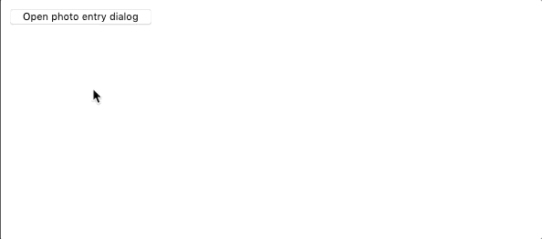

# Assignment 1
**Due by 11:59pm on Monday, 1/18/2021**<br/>
**Demo due by 11:59pm on Monday, 2/8/2021**

The goal of this assignment is to have you begin to write React components and compose them together into a simple application.  At the end, you will have written an application in which the user can click a button to open a dialog, enter information about photos into that dialog, and see those photos appear in the application when they click the dialog’s “accept” button.  More details about the application you’ll write are below.  First, here’s a short screen capture demonstrating how the application should roughly work:


## Application layout

Your application should be laid out in two columns.  The contents of each column should be as follows:
  * **Left column** – The left column should begin by containing only a button.  When the user clicks this button, a “dialog” should also appear in the left column.  More details about the dialog will be described below.
  * **Right column** – The right column will contain a list of all the photos submitted by the user.  More details about the photos will be described below.

## Photo submission dialog

When the user clicks the “open dialog” button in the left column, a dialog should appear in the left column, below the button.  This dialog will contain fields and controls that allow the user to submit information about a photo to be displayed in the application’s right column.  In particular, the dialog should contain the following elements:
  * A text field in which the user can enter the URL of a photo.
  * A text field in which the user can enter the caption of a photo.
  * An “accept” button.
  * A “cancel” button.

The dialog should have the following behaviors:
  * If the user enters values in both fields (photo URL and caption) and clicks the accept button, then a corresponding photo should be added to the right column, and the dialog should close.
  * If the user clicks the accept button while either text field is empty, then a small warning should appear to let the user know they need to enter both values.  The dialog should remain open in this case.
  * If the user hits the cancel button, then the dialog should close without further action.
  * Any time the dialog is closed (whether via the accept button or the cancel button), any values entered by the user in the text fields should be cleared.

Here is a screen capture demonstrating some of these behaviors:



## Photo list

The application’s right column should contain a list of all the photos submitted by the user via the dialog described above.  Each photo should display both an image and its corresponding caption.  The photos may be laid out in any sensible way (the layout doesn’t have to match the screen captures here) with the following constraints:
  * The most recently submitted photo should appear first in the list.
  * The photos may not overflow the viewport in the horizontal direction.  In other words, the user should not have to scroll horizontally to see more photos.  Scrolling vertically is fine.

## Application styling

To accomplish some of the layout required in the description above, you will need to write some CSS for the application.  The starter code is implemented so that CSS will be incorporated from [src/index.css](src/index.css), so it'll be easiest for you to write your CSS there.

Please don’t worry too much about giving your application a polished appearance, and don’t worry about exactly matching the styling of the screen captures here.  All you need to do is meet the layout requirements described above.  The rest of your styling can be very rudimentary.

One thing to note is that showing or hiding elements of the application (e.g. the dialog, the warning, the photos) *may not* be done using CSS.  In other words, you can’t use CSS properties like  `display: none;` or `visibility: hidden;` to hide things.  Instead, you must control the display of application elements by conditionally rendering them (e.g. based on some application state you keep) in your React components.

## Extra credit: allow the user to remove photos

For extra credit, you can add a button to each photo component that the user can click to remove the corresponding photo.  Only the photo corresponding to the clicked button should be removed, and all other photos should remain, displayed in the same order.  Again, this must be achieved by controlling the rendered elements via React, not via CSS.

Here is a screen capture demonstrating how the photo removal functionality might work:


## Working with this code

This project was bootstrapped with [Create React App](https://github.com/facebook/create-react-app), which is a tool we'll explore later in the course for (as the name implies) creating a React app.  Don't worry too much about the framework of code created by Create React App.

For now, you'll focus your development mainly on the file [src/index.js](src/index.js) (with a little bit of work needed in [src/index.css](src/index.css)).  Importantly, when you render your React app, you should use the `<div>` element with ID `"root"` in [public/index.html](public/index.html) as the root element.

Before running this app for the first time, make sure to run `npm install` to install needed dependencies.  Then, to run the app and see it in your browser, you can run
```
npm start
```
This will run the app in the development mode, and it should automatically open [http://localhost:3000](http://localhost:3000) to view the app in your browser (though you can manually open that URL in your browser, too).  The app is set up so that the page will reload if you make edits to the code.  You will also see any lint errors in the console.

## Assignment submission

We'll be using GitHub Classroom for this assignment, and you will submit your assignment via GitHub.  Just make sure your completed files are committed and pushed by the assignment's deadline to the master branch of the GitHub repo that was created for you by GitHub Classroom.  A good way to check whether your files are safely submitted is to look at the master branch your assignment repo on the github.com website (i.e. https://github.com/osu-cs499-w21/assignment-1-YourGitHubUsername/). If your changes show up there, you can consider your files submitted.

## Assignment grading

This assignment is worth 10 points total.  You can also earn 1 point of extra credit as described above.

Remember that in this course, programming assignments will be graded based on effort instead of correctness, and you will get full credit for an assignment if it is submitted on time and is clearly the product of a determined effort to solve the problem.  Again, If you’re unable to solve the homework problem, make sure to submit all code you’ve written, and then describe in comments in the source code the following three things:
  1. How you attempted to solve the problem.
  2. Where you ran into trouble.
  3. What options you think (conceptually) might lead to a working solution.

Note, however, that to earn extra credit for the assignment, the extra credit features must work correctly.  In other words, the extra credit will be graded based on correctness, not just effort.
